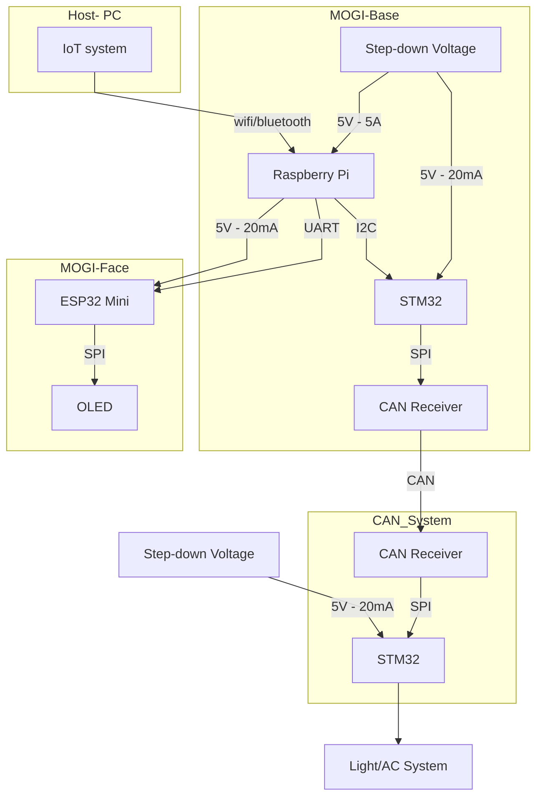

# SƠ ĐỒ KHỐI AUTOMATE

```mermaid

flowchart TB
    %% ======= Nhóm MOGI-Base =======
    subgraph MOGI-Base
        direction TB
        A[Step-down Voltage] -->|5V - 5A| Rasp[Raspberry Pi]
        A --> |5V - 20mA|STM[STM32]
        Rasp -->|I2C| STM[STM32]
        STM -->|SPI| D[CAN Receiver]
    end

    %% ======= Nhóm MOGI-Base =======
    subgraph Host- PC
        host[IoT system] -->|wifi/bluetooth| Rasp
    end

    %% ======= Nhóm MOGI-Face =======
    subgraph MOGI-Face
        direction TB
        ESP[ESP32 Mini] -->|SPI| F[OLED]
    end

    %% ======= Nhóm CAN System =======
    subgraph CAN_System
        direction TB
        G[CAN Receiver] -->|SPI| H[STM32]
    end
    A2[Step-down Voltage] --> |5V - 20mA|H
    H --> I[Light/AC System]

    %% ======= Kết nối giữa các nhóm =======
    Rasp -->|UART| ESP
    Rasp -->|5V - 20mA| ESP
    D -->|CAN| G
%%{init: {'themeVariables': {'lineCurve': 'linear'}, 'flowchart': {'curve': 'linear'}}}%%

```